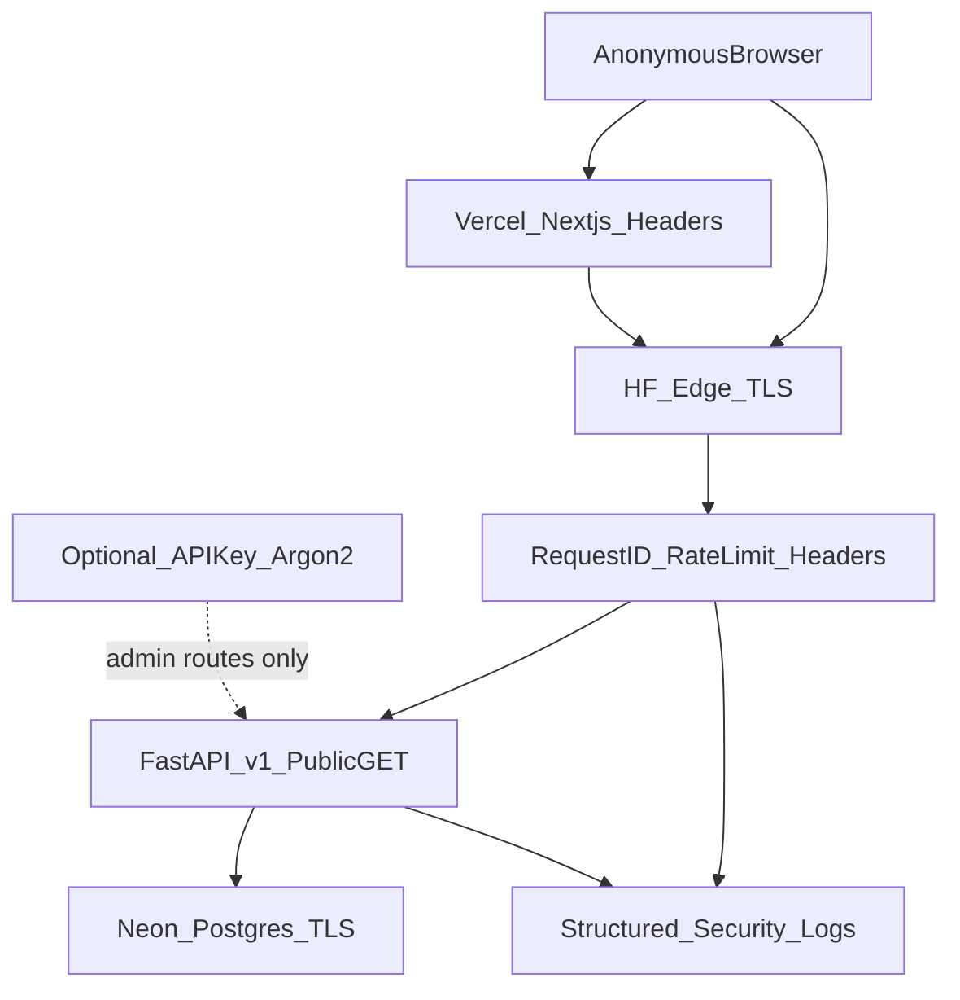
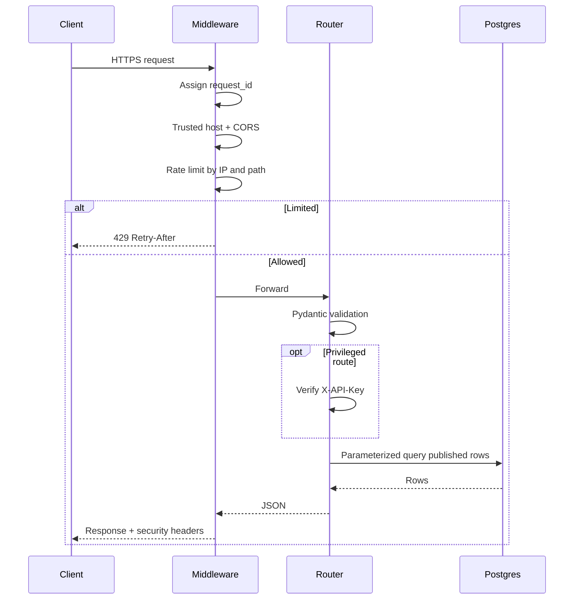
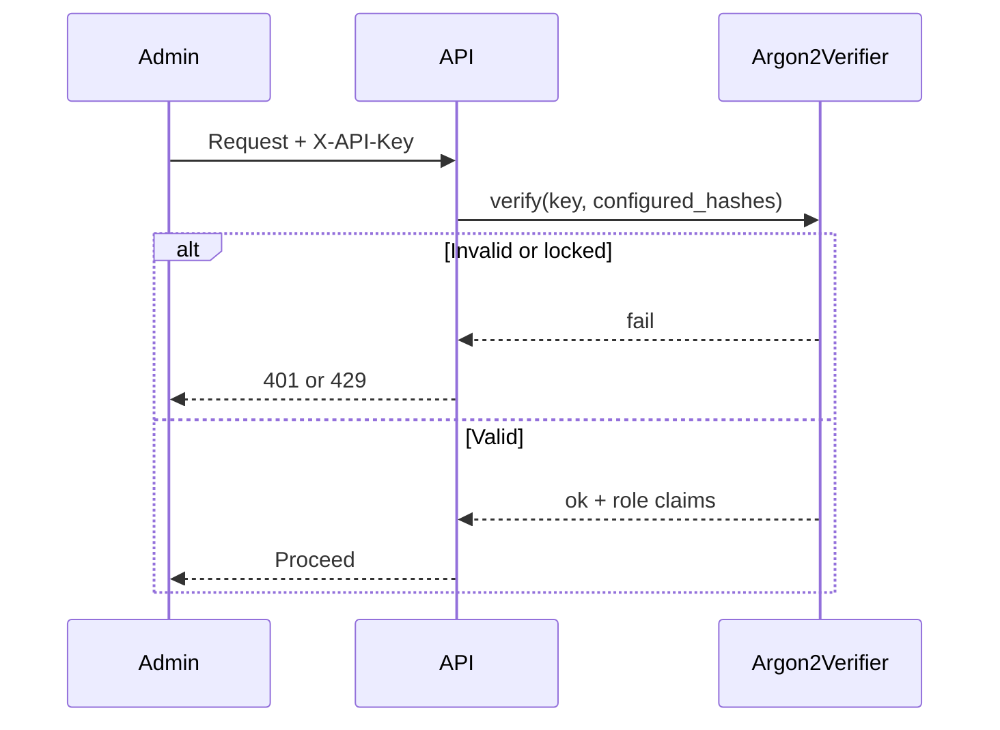
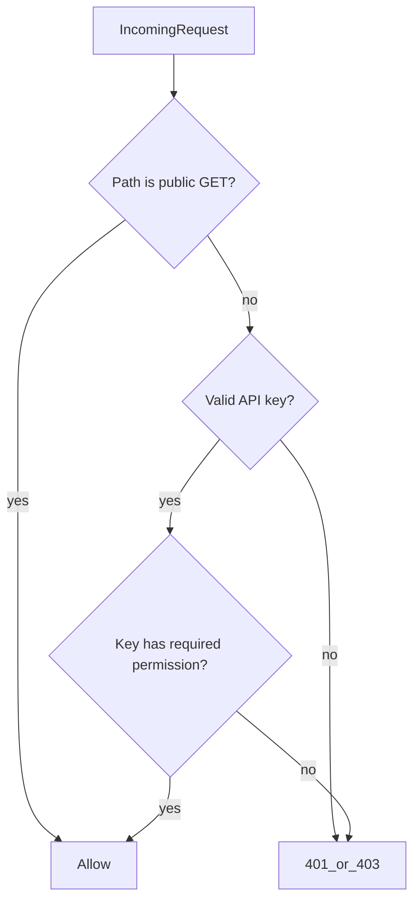

# Security Architecture — Pakistan Public Corruption Atlas

Public read-only OSINT research API. Anonymous browse is intentional. This document catalogs every security control: **implemented**, **platform-provided**, or **N/A** for this threat model.

**Stack:** Next.js on Vercel · FastAPI on Hugging Face Spaces · Neon PostgreSQL · GitHub (open source)

---

## Decision

| Choice | Rationale |
|--------|-----------|
| No end-user accounts | Site serves a consolidated public database for review |
| No OAuth / MFA / password reset | No user identity surface to protect |
| Optional staff API keys | Future write/admin ops; public GETs stay keyless |
| Open-source safe | Secrets never in repo; examples only |

---

## Feature catalog

Each feature uses the same template: why (≤20 words) · where · code · packages · env · DB · frontend · backend · tests · mistakes.

### Identity

#### User authentication — **N/A**

1. **Why:** Public catalog needs no login; accounts add risk without product value.
2. **Where:** N/A — browsers hit public GETs.
3. **Code:** None.
4. **Packages:** None.
5. **Env:** None.
6. **DB:** No `users` table.
7. **Frontend:** No auth UI.
8. **Backend:** Anonymous read.
9. **Tests:** Assert public routes return 200 without credentials.
10. **Mistakes:** Adding unused auth “for later” and shipping weak defaults.

#### Email verification / Password reset / MFA / OAuth / JWT sessions / RBAC UI — **N/A**

Same rationale as authentication. Staff privileges use **hashed API keys** + permission checks on future mutating routes (see API Protection).

#### Session management / JWT refresh & rotation — **N/A**

1. **Why:** No browser sessions; API is stateless public read.
2. **Where:** N/A.
3–10. Covered by optional API keys for privileged ops only.

#### Role-Based Access Control & permission middleware — **Partial (API keys)**

1. **Why:** Gate future admin writes without building a full user system.
2. **Where:** `api/app/deps.py`, `api/app/security/api_keys.py`.
3. **Code:** `require_api_key` / `require_permission` dependencies; public routers omit them.
4. **Packages:** `argon2-cffi`.
5. **Env:** `API_KEY_HASHES`, `API_KEY_PEPPER`.
6. **DB:** Optional; hashes may live in env for small ops teams.
7. **Frontend:** None for public UI; admin tools would send `X-API-Key`.
8. **Backend:** Verify Argon2id hash; lockout after failures.
9. **Tests:** Invalid key → 401; locked key → 429.
10. **Mistakes:** Storing plaintext keys in env or git; putting keys in `NEXT_PUBLIC_*`.

---

### API Protection

#### API authentication

1. **Why:** Distinguish anonymous readers from privileged operators.
2. **Where:** Header `X-API-Key` on protected routes only.
3. **Code:** `api/app/security/api_keys.py`, `api/app/deps.py`.
4. **Packages:** `argon2-cffi`.
5. **Env:** `API_KEY_HASHES` (JSON array of hashes).
6. **DB:** None required.
7. **Frontend:** Public client sends no key ([`frontend/src/lib/api.ts`](../frontend/src/lib/api.ts)).
8. **Backend:** Public GETs unprotected; export may optionally require key via flag.
9. **Tests:** Key accept/reject.
10. **Mistakes:** Requiring keys for all public read traffic.

#### API key management

1. **Why:** Rotate and revoke operator credentials without redeploying identity providers.
2. **Where:** Hash generator script + env rotation docs.
3. **Code:** `api/scripts/hash_api_key.py`.
4. **Packages:** `argon2-cffi`.
5. **Env:** Replace `API_KEY_HASHES` on rotation; keep old hash until cutover done.
6. **DB:** N/A (env-based).
7. **Frontend:** N/A.
8. **Backend:** Constant-time verify against all configured hashes.
9. **Tests:** Multiple hashes; rotation still validates either during overlap.
10. **Mistakes:** Logging raw keys; single shared forever key.

#### Rate limiting & request throttling

1. **Why:** Stop scrape storms and export abuse on a shared HF replica.
2. **Where:** `api/app/middleware/rate_limit.py` (global + path tiers).
3. **Code:** In-memory token bucket keyed by client IP + path class.
4. **Packages:** Stdlib only (optional Redis later via `REDIS_URL`).
5. **Env:** `RATE_LIMIT_DEFAULT`, `RATE_LIMIT_SEARCH`, `RATE_LIMIT_EXPORT`, `RATE_LIMIT_WINDOW_SECONDS`.
6. **DB:** None.
7. **Frontend:** Handle 429 gracefully if added later.
8. **Backend:** Middleware returns 429 + `Retry-After`.
9. **Tests:** Exceed limit → 429.
10. **Mistakes:** One global limit for health checks; forgetting HF proxy `X-Forwarded-For`.

#### Request signing — **N/A (public GET)**

1. **Why:** Browser GETs cannot hold HMAC secrets; signing fits server-to-server only.
2. **Where:** Document for future scraper→API ingest webhooks.
3–10. Implement HMAC when private ingest endpoints exist.

#### CORS

1. **Why:** Block hostile origins from reading API responses in browsers.
2. **Where:** [`api/app/main.py`](../api/app/main.py) + `CORS_ORIGINS`.
3. **Code:** Strict allowlist; `allow_credentials=False` for public API.
4. **Packages:** Starlette built-in.
5. **Env:** `CORS_ORIGINS` (JSON list of Vercel URLs).
6. **DB:** None.
7. **Frontend:** Same-origin or allowlisted API URL only.
8. **Backend:** No `*`.
9. **Tests:** Disallowed origin omitted from ACAO.
10. **Mistakes:** `allow_origins=["*"]` with credentials.

#### CSRF protection — **N/A (no cookie sessions)**

1. **Why:** Credential-less Bearer/API-key or anonymous GET avoids classic CSRF.
2. **Where:** N/A until cookie auth exists.
3–10. Add SameSite + CSRF tokens if sessions are introduced.

#### Idempotency keys

1. **Why:** Safe retries for future POSTs (ingest/publish) without duplicate writes.
2. **Where:** `api/app/middleware/idempotency.py`.
3. **Code:** Honor `Idempotency-Key` on non-GET; no-op on GET.
4. **Packages:** None.
5. **Env:** `IDEMPOTENCY_TTL_SECONDS`.
6. **DB:** Optional later; in-memory for single replica.
7. **Frontend:** N/A today.
8. **Backend:** Middleware cache.
9. **Tests:** Duplicate POST returns cached response when routes exist.
10. **Mistakes:** Applying to GET; unbounded key store.

#### API versioning

1. **Why:** Evolve contracts without breaking open-source clients.
2. **Where:** `/api/v1/*`; `API-Version` response header.
3. **Code:** Router prefixes + header middleware.
4–10. Never remove `v1` without a deprecation window.

---

### Data Protection

#### Encryption at rest — **Platform**

1. **Why:** Protect Neon volumes and HF/Vercel disks from physical/storage theft.
2. **Where:** Neon encrypted storage; cloud disk encryption.
3. **Code:** Ops checklist (enable TLS + Neon defaults).
4. **Packages:** None.
5. **Env:** `DATABASE_URL` with `sslmode=require`.
6. **DB:** Neon managed.
7. **Frontend:** N/A.
8. **Backend:** Prefer TLS DB URLs in production.
9. **Tests:** Config rejects insecure prod DB URLs when enforced.
10. **Mistakes:** Assuming app-level AES replaces disk encryption.

#### TLS everywhere — **Platform + config**

1. **Why:** Stop MITM between browser, Vercel, HF, and Neon.
2. **Where:** Vercel HTTPS, HF Spaces HTTPS, Neon SSL.
3. **Code:** HSTS header in prod; `sslmode=require`.
4. **Packages:** None.
5. **Env:** Production `ENVIRONMENT=production`.
6–10. Never terminate TLS only on CDN while talking cleartext to DB.

#### Password hashing (Argon2)

1. **Why:** Hash staff API keys at rest (same primitive as passwords).
2. **Where:** `api/app/security/hashing.py`.
3. **Code:** Argon2id hash/verify.
4. **Packages:** `argon2-cffi`.
5. **Env:** `API_KEY_PEPPER` (optional server-side pepper).
6. **DB:** None.
7. **Frontend:** N/A.
8. **Backend:** Never store plaintext keys.
9. **Tests:** Verify round-trip; wrong key fails.
10. **Mistakes:** Using MD5/SHA for keys; logging verify inputs.

#### Secure secret management & rotation

1. **Why:** Open-source repo must not leak production credentials.
2. **Where:** HF Space secrets, Vercel env, Neon dashboard, GitHub Environments.
3. **Code:** `.env.example` placeholders only; rotation section below.
4. **Packages:** None.
5. **Env:** All secrets via platform UIs.
6. **DB:** Rotate DB password; update HF secret.
7. **Frontend:** Only `NEXT_PUBLIC_API_URL` (non-secret).
8. **Backend:** Restart after secret change.
9. **Tests:** CI greps for private key patterns (secret scanning).
10. **Mistakes:** Committing `.env`; putting secrets in README screenshots.

#### Field-level encryption — **N/A**

1. **Why:** No private user PII vault; OSINT case data is intentionally public.
2. **Where:** N/A.
3–10. Revisit if private notes/drafts with personal contact data are stored.

---

### Input Security

#### Input / schema validation

1. **Why:** Reject malformed filters before they hit the DB.
2. **Where:** Pydantic models + FastAPI `Query` constraints.
3. **Code:** Year bounds 1960–2026, max `q` length, page size caps.
4. **Packages:** `pydantic`.
5. **Env:** `MAX_QUERY_LENGTH`, `MAX_PAGE_SIZE`.
6. **DB:** CHECK constraints already on years.
7. **Frontend:** Encode path params (`encodeURIComponent`).
8. **Backend:** 422 on invalid input.
9. **Tests:** Oversized `q` → 422.
10. **Mistakes:** Trusting client-only validation.

#### SQL/NoSQL injection protection

1. **Why:** Query params must never become executable SQL.
2. **Where:** SQLAlchemy bound parameters in services.
3. **Code:** `ilike` with bound values; no f-string SQL.
4. **Packages:** `sqlalchemy`.
5. **Env:** None.
6. **DB:** Least-privilege `SELECT` role.
7. **Frontend:** N/A.
8. **Backend:** Code review ban on `text(f"...")`.
9. **Tests:** Injection-like `q` returns empty/safe 200, not 500.
10. **Mistakes:** String-concatenating filters.

#### XSS / HTML sanitization

1. **Why:** Case text could contain hostile markup from sources.
2. **Where:** React text nodes; no `dangerouslySetInnerHTML`.
3. **Code:** Frontend components; API returns JSON only.
4. **Packages:** None required today; `bleach` if HTML ever stored.
5. **Env:** CSP on frontend.
6–10. Never render raw HTML from API without sanitization.

#### File upload / MIME / malware — **N/A**

1. **Why:** No upload endpoints in current API.
2. **Where:** Future admin uploads would use allowlists + virus scan hooks.
3–10. Document hooks in this file when uploads ship.

---

### Browser Security

Implemented primarily in [`frontend/next.config.ts`](../frontend/next.config.ts) and API security-headers middleware.

| Header | Purpose |
|--------|---------|
| Content-Security-Policy | Reduce XSS/data exfil impact |
| Strict-Transport-Security | Force HTTPS (prod) |
| X-Frame-Options | Clickjacking resistance |
| X-Content-Type-Options | Stop MIME sniffing |
| Referrer-Policy | Limit referrer leakage |
| Permissions-Policy | Disable unused browser APIs |
| Secure / SameSite cookies | N/A until auth cookies exist |

---

### Abuse Prevention

| Control | Status |
|---------|--------|
| CAPTCHA after suspicious export activity | Optional Cloudflare Turnstile (`TURNSTILE_*`) |
| Login brute-force / account lockout | Applied to API-key attempts |
| IP reputation / bot detection | Lightweight UA checks on export; platform WAF |
| Device fingerprinting | **N/A** — privacy-hostile for public research site |
| Spam detection | **N/A** — no user-generated posts |

---

### Database

| Control | Status |
|---------|--------|
| Least-privilege roles | [`database/roles.sql`](../database/roles.sql) |
| Row-level security | **Deferred** — single public tenant catalog; use `is_published` |
| Soft deletes / publish flag | `is_published`, `deleted_at` on `scandals` |
| Automatic backups / PITR | Neon platform — enable in dashboard |
| Audit / security_events | App logs + optional `security_events` table |
| Retention | Truncate/hash IPs in logs after abuse window (see Privacy) |

---

### Monitoring

| Control | Implementation |
|---------|----------------|
| Structured logging | JSON logs via `api/app/security/logging.py` |
| Security event logging | `log_security_event(...)` |
| Failed API-key monitoring | Lockout + structured events |
| Health checks | `/health` liveness, `/health/ready` DB |
| Error monitoring | Optional `SENTRY_DSN` |
| Intrusion alerts | Alert on rate-limit / key-lockout spikes (ops) |

---

### DevSecOps

| Control | Location |
|---------|----------|
| Secret Scanning / push protection | GitHub org/repo settings (checklist) |
| Dependabot | `.github/dependabot.yml` |
| Branch protection | Checklist below |
| Signed commits | Recommended for maintainers |
| CI security | `.github/workflows/security.yml` |
| pip-audit / npm audit | CI jobs |
| SAST | Bandit on `api/` |
| DAST | Optional ZAP workflow (manual/staging) |
| License scanning | `pip-licenses` in CI (informational) |

---

### Infrastructure

| Control | Notes |
|---------|-------|
| Env separation | `ENVIRONMENT=development\|staging\|production` |
| Secure env vars | HF / Vercel / Neon secrets UIs |
| CDN / DDoS / WAF | Vercel + HF edge; app rate limits as backup |
| Automatic HTTPS | Platform default |

---

### Privacy

| Control | Notes |
|---------|-------|
| GDPR-ready architecture | No accounts; minimize request logs |
| User data export/deletion | N/A for accounts; research export is public case data |
| Cookie consent | N/A until non-essential analytics cookies |
| PII masking | Hash/truncate client IPs in logs |
| Data minimization | Log path + status + request_id, not bodies |

---

## Folder structure (security-relevant)

```
api/app/
  config.py                 # env, prod guards
  deps.py                   # API key / permission deps
  main.py                   # middleware stack, docs off in prod
  middleware/
    security_headers.py
    rate_limit.py
    request_id.py
    idempotency.py
  security/
    hashing.py              # Argon2id
    api_keys.py
    logging.py
    events.py
    turnstile.py            # optional CAPTCHA
  routers/health.py         # /health, /health/ready
api/scripts/hash_api_key.py
api/tests/test_security.py
database/
  schema.sql                # is_published, deleted_at, security_events
  roles.sql                 # least-privilege roles
frontend/next.config.ts     # CSP and browser headers
.github/
  dependabot.yml
  workflows/security.yml
docs/SECURITY.md            # this file
```

---

## Security architecture diagram



---

## Request lifecycle



---

## Authentication flow (staff API key only)



Public readers: **no authentication step**.

---

## Authorization flow



---

## Threat model

| Threat | Impact | Mitigation |
|--------|--------|------------|
| Bulk scrape / export DoS | HF CPU, DB load | Rate limits, export caps, optional Turnstile |
| CORS misconfig | Data read by evil sites | Strict origin allowlist |
| Demo seed in production | Wrong/incomplete data | `ENVIRONMENT=production` disables seed/SQLite |
| Secret leak via git | Full DB/API compromise | `.gitignore`, secret scanning, examples only |
| Injection via `q` | Data theft / crash | Pydantic + SQLAlchemy binds |
| Open `/docs` in prod | Attack surface mapping | Docs disabled in production |
| Draft cases leaked | Premature publication | `is_published` + `deleted_at` filters |
| Dependency CVE | RCE / supply chain | Dependabot, pip-audit, npm audit |

---

## OWASP Top 10 coverage

| OWASP | Coverage |
|-------|----------|
| A01 Broken Access Control | Public-by-design reads; API keys for privileged; publish flag |
| A02 Cryptographic Failures | TLS; Argon2id for keys; no plaintext secrets in repo |
| A03 Injection | Parameterized ORM; input length/enum validation |
| A04 Insecure Design | Threat model matches public OSINT; no unused auth |
| A05 Security Misconfiguration | Hardened headers, CORS, docs off, trusted hosts |
| A06 Vulnerable Components | Dependabot + CI audits |
| A07 Auth Failures | API-key lockout; N/A for end-user passwords |
| A08 Software/Data Integrity | CI, Dependabot, signed commits recommended |
| A09 Logging/Monitoring Failures | Structured security events + Sentry optional |
| A10 SSRF | No user-controlled server-side fetch in API |

---

## Production deployment checklist

1. Neon Postgres created; run `database/schema.sql` then `database/roles.sql`.
2. `DATABASE_URL` uses TLS (`sslmode=require`); app role is `ppca_app` (SELECT).
3. HF Space secrets: `DATABASE_URL`, `CORS_ORIGINS`, `ENVIRONMENT=production`, `API_KEY_HASHES` if needed.
4. `USE_SQLITE=false`, `SEED_ON_STARTUP=false`, `REPLACE_SEED_ON_STARTUP=false`.
5. `DISABLE_DOCS=true` (or rely on production default).
6. `CORS_ORIGINS` = exact Vercel production (+ preview if required).
7. Rate limits and `EXPORT_MAX_ROWS` set for expected traffic.
8. Vercel: `NEXT_PUBLIC_API_URL` = HF HTTPS origin; confirm security headers.
9. GitHub: Dependabot on, secret scanning + push protection, branch protection on `main`.
10. Verify `/health` ok, `/health/ready` ok, `/docs` 404, sample case 200.
11. Confirm unpublished rows (`is_published=false`) are not returned.
12. Neon PITR / backups enabled; document restore owner.
13. Optional: `SENTRY_DSN`, Turnstile for export abuse.
14. Rotate any keys that ever appeared in chat/logs.

---

## Environment variables (reference)

| Variable | Layer | Notes |
|----------|-------|-------|
| `ENVIRONMENT` | API | `development` / `staging` / `production` |
| `DATABASE_URL` | API | Async Postgres URL + SSL in prod |
| `USE_SQLITE` | API | Must be false in production |
| `SEED_ON_STARTUP` | API | Forced off in production |
| `CORS_ORIGINS` | API | JSON list |
| `TRUSTED_HOSTS` | API | JSON list or `*` in local dev |
| `RATE_LIMIT_*` | API | Per-tier limits |
| `EXPORT_MAX_ROWS` | API | Cap export size |
| `DISABLE_DOCS` | API | Hide OpenAPI UI |
| `API_KEY_HASHES` | API | JSON array of Argon2 hashes |
| `API_KEY_PEPPER` | API | Optional pepper |
| `REQUIRE_API_KEY_FOR_EXPORT` | API | Optional hardening |
| `TURNSTILE_SECRET_KEY` | API | Optional CAPTCHA |
| `TURNSTILE_SITE_KEY` | Frontend | Only if CAPTCHA UI added |
| `SENTRY_DSN` | API | Optional |
| `LOG_LEVEL` | API | default `INFO` |
| `NEXT_PUBLIC_API_URL` | Frontend | Public API origin only |

---

## Secret rotation (operators)

1. Generate new API key; `python api/scripts/hash_api_key.py`.
2. Add new hash to `API_KEY_HASHES` (keep old briefly).
3. Distribute new key; remove old hash; restart Space.
4. DB password: rotate in Neon → update HF secret → restart.
